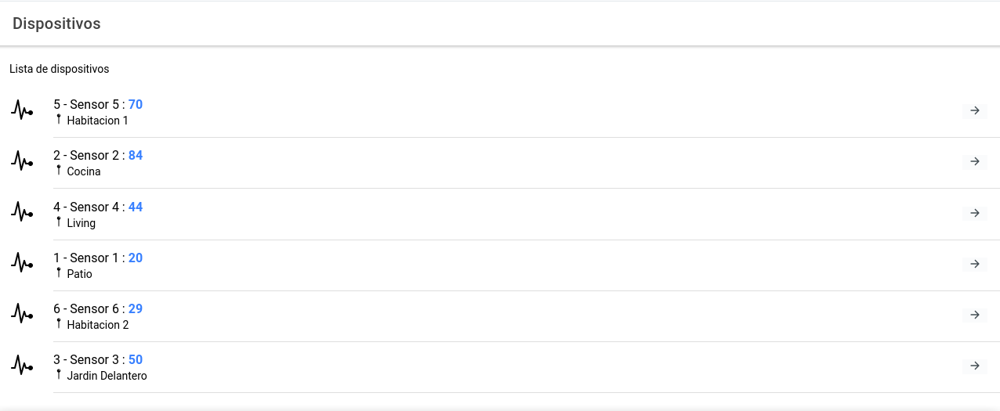

##### Autor:  Claudio Omar Biale - 2020

# Introducción

El proyecto corresponde al trabajo final de la asignatura **Desarrollo de Aplicaciones Multiplataforma** de la *Especialización en Internet de las Cosas* dictada en la *Facultad de Ingenieria* de la *Universidad de Buenos Aires*.

El sistema permite:
- controlar la apertura y cierre de la electroválvula de diferentes dispositivos,
- ver las mediciones de cada dispositivo y
- ver el logs de operaciones sobre la electroválvula.


Tabla de contenidos:
=========================
* [Correr la aplicación](#Correr-la-aplicación)  
* [Detener la aplicación](#Detener-la-aplicación)
* [Notas sobre el backend](#Notas-sobre-el-backend)
* [Imágenes](#Imágenes)
* [Contribuir](#Contribuir)
* [Licencia](#Licencia)


## Correr la aplicación

Para correr la aplicación es necesario descargar el repositorio y luego ejecutar los siguientes comandos:

1-  Levantar la base de datos (MariaDB) y Adminer:

```sh
$ docker-compose up
```
2- Instalar dependencias del servidor:

```sh
$ cd backend
$ npm install
```

2- Insertar datos iniciales (solo primera vez que se ejecuta el sistema):

```sh
$ nodejs ./db/db.js
```

3- Ejecutar `servidor`

```sh
$ nodejs index.js
```
4- Instalar dependencias y ejecutar comando para compilar y servir `Ionic`:

Si se encuentra en el directorio `backend`:
```sh
$ cd ..
```

Ejecutar:

```
$ npm install
$ ionic serve
```

## Consideraciones

En la pantalla de dispositivo se activa un callback para simular llegada de valores nuevos (cada 30 segundos). El funcionamiento se encuentra comentado en `controlMediciones` dentro del archivo `ver-dispositivo.page.ts`.

Se han desarrollado dos pipes, para ver su código fuente debe ir al directorio [pipes](src/app/pipes). Uno especifica un formato de fecha y el otro de acuerdo al valor de estado de la electroválvula permite especificar *Encendido* o *Apagado*.


Se ha desarrollado una directiva, para ver su código fuente debe ir al directorio [directivas](src/app/directivas). De acuerdo a un valor que recibe como argumento (el valor de una lectura), muestra la misma en verde (valor <= 10), amarillo (valor > 10 y <= 30) o rojo (valor > 30).

Se ha desarrollado un solo servicio en el backend, dado que no considere necesario desarrollar varios, porque eran pocos tipos de peticiones. Las peticiones soportadas son:
- Obtener listado de dispositivos.
- Obtener datos de un dispositivo.
- Obtener mediciones de un dispositivo.
- Obtener logs de una electroválvula.
- Insertar nueva medición.
- Insertar nuevo log.

En el Backend se ha desarrollado el esquema de CRUD en dispositivos, electrovalvulas, mediciones y log-riegos. No se encuentran completas o testeadas todas las opciones.

## Notas sobre el backend

Para obtener un detalle de los requerimientos y tablas generadas en el backend dirijase al siguiente enlace:
[notas](backend/readme.md)

## Imágenes

Listar dispositivos: 



Ver dispositivo:


Ver mediciones:


Ver log de riegos:


## Contribuir

Para contribuir realizar un pull request con las sugerencias.


## Licencia

GPL
